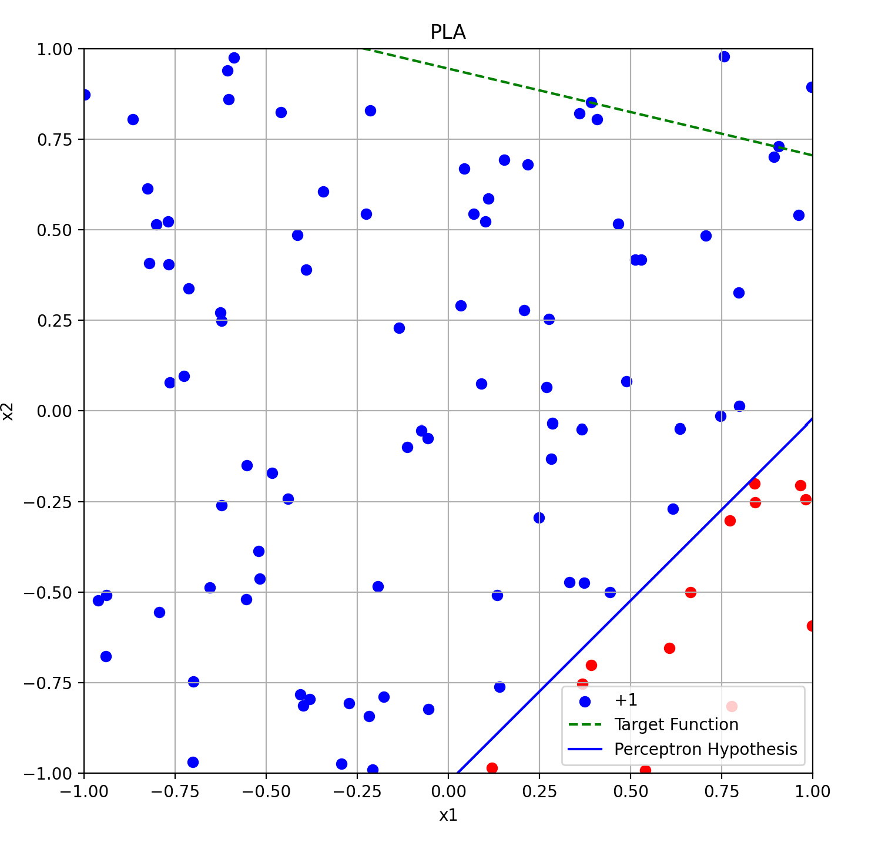
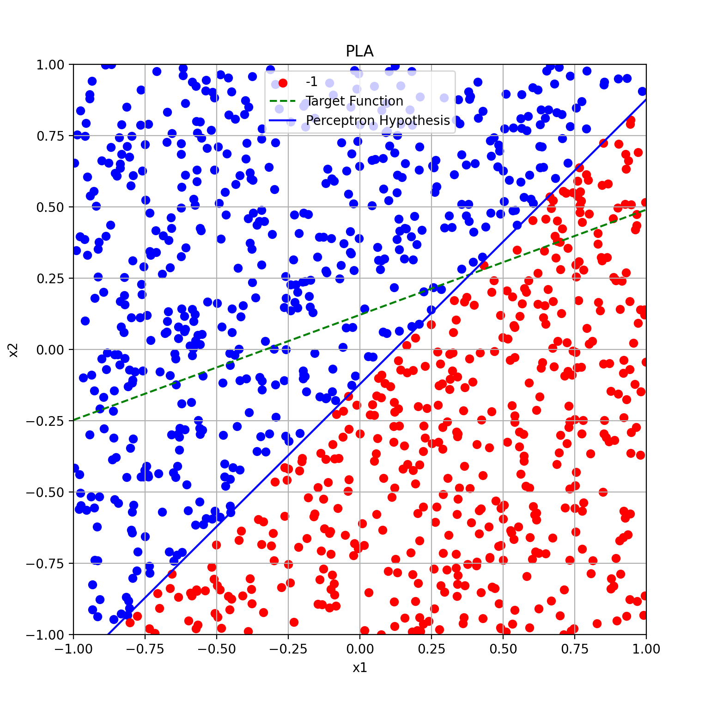

# Perceptron Learning Algorithm (PLA)

### Overview 

This project demonstrates the Perceptron Learning Algorithm (PLA) for binary classification in 2D space and extends it to higher dimensions (10D, etc.). The program uses randomly generated data to train the perceptron model, visualizes its performance in 2D, and displays key metrics like the number of updates before convergence.

### Features

* Randomly generates a target linear function in 2D space.
* Creates datasets for binary classification based on the target function.
* Implements the Perceptron Learning Algorithm to classify data points.
* Visualizes the target function and learned hypothesis in 2D.
* Extends the Perceptron Learning Algorithm to higher-dimensional spaces (10D).
* Reports the number of updates required for convergence.

### To Run 
* ```bash pip install requirements.txt

* ```bash python pla.py


## Outputs 
1. 2D Visualization: The program generates two 2D plots:

    * Target Function: A randomly generated line used as the ground truth for classification.
    * Learned Hypothesis: The line learned by the Perceptron Algorithm after convergence.

2. Update Count: The number of updates required for the algorithm to converge is printed for each dataset.

3. Higher Dimensions- 10D:
    * The target weights and bias for a randomly generated dataset in a higher-dimensional space are displayed.
    * The weights and bias learned by the algorithm are also printed.

### Example Outputs
(Note: Outputs may vary due to random dataset generation.)

### For 2D Data (size=100)


```python
Updates before convergence: 54
```
### For 2D Data (size=1000)


```python
Updates before convergence: 169
```

### For 10D Data (size=1000)
```python 
Updates before convergence:  4511
Target weights: [-2.91713876e-01 -7.72287283e-01  4.71980090e-01 -2.19131976e-01
 -2.49918054e+00 -3.98529287e-01  1.53326695e-01 -8.98171092e-01
  8.21684405e-01  2.02273941e-04]
Learned weights:  [-10.01232972 -25.84075328  16.99732077  -7.60426837 -86.66905751
 -14.36719349   5.16970156 -30.31656957  27.86688114  -1.7318276 ]       
Target bias: -0.3017418664783665
Learned bias:  -11.0
```


